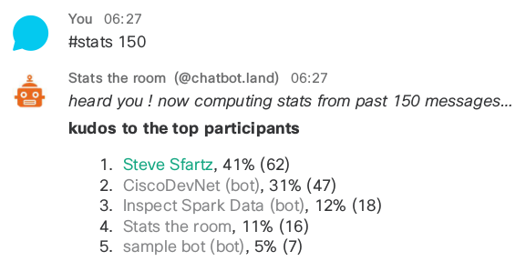
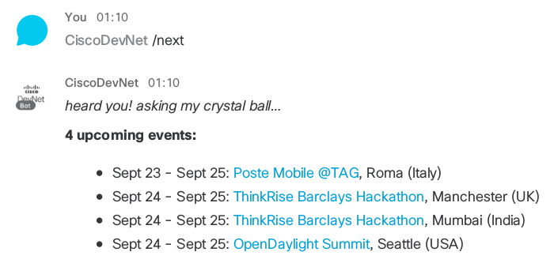
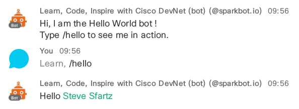

# Cisco Spark Bot examples in nodejs

Interested in creating your own Cisco Spark bots ? 

Go through the examples below.

If you feel inspired, follow the guides to run your own version of these bots: [Guide to run on Cloud9](docs/GuideToRunLocally.md) and [Guide to run locally](docs/GuideToRunOnCloud9.md).  

Or pick a [template](templates/) that suits your scenario, and customize it.

Note that these bot samples code leverage the [node-sparkbot](https://github.com/CiscoDevNet/node-sparkbot) Bot framework.

__and if you're new to Cisco Spark Apps, note that DevNet provides 10 to 20' [Learning labs](https://learninglabs.cisco.com/labs).__

## [inspect](examples/inspector.js)

Provides instant access to Cisco Spark technical data.

Features illustrated by this example:
- **Help command to display available commands**
- **About command to get meta info about the bot**
- **Welcome message as the bot is added in a room**
- **Fallback message if a command is not recognized**
- Uses "node-sparky" library to wrap calls to the Cisco Spark REST API

This bot can be run as is with either a Developer or a Bot access token 

Invite _inspect@sparkbot.io_ to meet the bot.

## [roomId](examples/roomid-phantom.js)

Fetches the identifier of the room in which this bot has just been added, 
pushes the roomId via a direct message, and leaves the inquired room right away.

Features illustrated by this example:
- Help command to display available commands
- About command to get meta info about the bot
- Fallback message if a command is not recognized
- **Send a direct message and leaves the room**
- Uses "node-sparky" library to wrap calls to the Cisco Spark REST API

Invite _roomid@sparkbot.io_ to meet the bot.

## [room-stats](examples/room-stats.js)

Computes stats for the room it is invoked from. 

Features illustrated by this example:
- Help message to display bot commands
- Welcome message as the bot is added in a room
- **Custom command prefix #**
- **Markdown formatting with lists & mentions**
- **Runs with a Developer account**
- Uses "node-sparky" library to wrap calls to the Cisco Spark REST API

Note that this webhook must be run with a Developer access token (either your's or a fake Spark account), because we must fetch all messages from rooms, not only those where bot is mentionned.

Invite _stats@chatbot.land_ to meet the bot.

## [events](examples/devnet/bot.js)

Tells you about upcoming DevNet events.

Features illustrated by this example:
- Help command to display available commands
- About command to get meta info about the bot
- Welcome message as the bot is added in a room
- Fallback message if a command is not recognized
- **Command with integer argument** 
- **Invokes a public REST API: [devnet-events-api](https://devnet-events-api.herokuapp.com/api/v1/events?limit=100)**
- **Markdown formatting with lists and hyperlinks**
- Uses "node-sparky" library to wrap calls to the Cisco Spark REST API

Invite _CiscoDevNet@sparkbot.io_ to meet the bot.

## [helloworld](examples/helloworld.js)

A simple template to start from.

Features illustrated by this example:
- Welcome message as the bot is added in a room
- Help command to display available commands
- Fallback message if a command is not recognized
- **Markdown formatting with mention**
- Uses "node-sparkbot" library to wrap calls to the Cisco Spark REST API

This bot can be run as is with either a Developer or a Bot access token 

